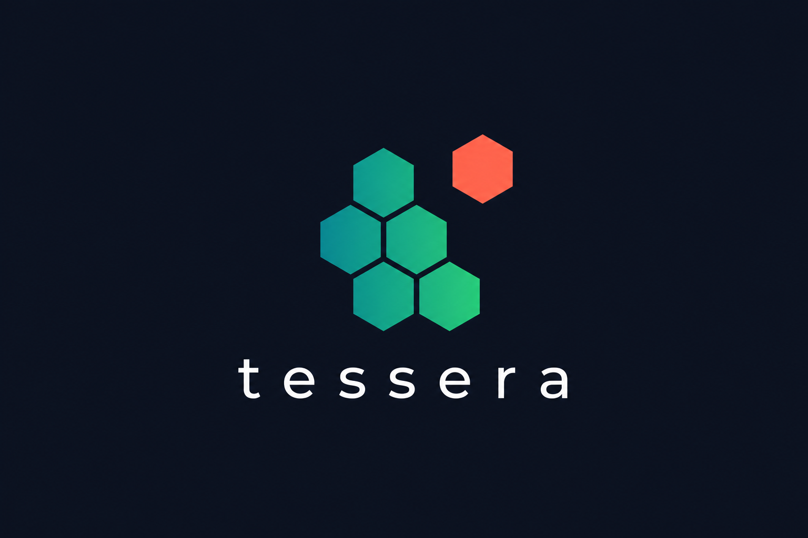

# LatticeUI

A next-generation design system, built against the failure modes of MUI, Ant Design, and Chakra UI.

> A *latticeui* is a single tile in a mosaic: small, stable parts composing a whole.

**📖 Documentation & live playground: https://amit641.github.io/latticeui**



## The problems with today's libraries

| Pain point | What it looks like in practice |
| --- | --- |
| **Customization cliff** | The first 80% is easy; the last 20% means fighting specificity, undocumented class names (`.MuiButton-root`), and `!important`. |
| **Runtime CSS-in-JS tax** | Emotion/styled-components compute styles in JS: bigger bundles, slower hydration, incompatible with React Server Components. |
| **No ownership middle ground** | An npm package locks you out of internals. Copy-paste kits hand you the code but cut you off from upstream fixes forever. |
| **Monolithic prop-explosion APIs** | A `<DatePicker>` with 150 props instead of composable parts. When the prop you need doesn't exist, you're stuck. |
| **Framework lock-in** | React-only; behavior can't be reused by Vue/Svelte. |
| **AI hallucinates your UI** | LLMs emit outdated component APIs because no library ships a machine-readable contract. |

## The six ideas in LatticeUI

1. **Anatomy contract** — every component renders stable `data-scope` / `data-part` attributes. These are a *versioned public API*: style and test against them and they will not break across minor releases. No class-name spelunking.
2. **Zero-runtime styling via cascade layers** — all CSS lives in `@layer latticeui`. Plain (unlayered) application CSS always wins, so overrides never need `!important`. RSC-safe; no style runtime.
3. **Framework-agnostic core** — behavior (state machines, focus, keyboard, a11y wiring) lives in plain TypeScript in `latticeui-core`. React is a thin adapter; other adapters can follow.
4. **Eject with an upgrade path** — `latticeui add button` copies source into your repo (you own it), and `latticeui update button` runs a 3-way merge to bring upstream fixes into your modified copy. The shadcn benefit without the dead end.
5. **Token-first theming** — W3C design-token JSON is the single source of truth, compiled to reference + semantic CSS-variable tiers and typed maps. Swap themes with one `data-theme` attribute.
6. **AI-native manifests** — every component ships `manifest.json` (anatomy, props, a11y, examples), aggregated into `llms.txt` so coding agents generate correct usage.

## Monorepo layout

```
latticeui/
├── packages/
│   ├── tokens/   latticeui-tokens  W3C token JSON -> CSS variables + TS types
│   ├── core/     latticeui-core    state machines + anatomy contracts (zero deps)
│   ├── styles/   latticeui-styles  zero-runtime CSS recipes (@layer latticeui)
│   ├── react/    latticeui   composable part components + hooks + manifests
│   └── cli/      latticeui-cli     add / eject / update with 3-way merge
├── apps/docs/                     Next.js docs + live playground (dark-first)
├── registry/                      component source registry consumed by the CLI
└── scripts/                       registry + llms.txt generators
```

## Install

```bash
npm install latticeui latticeui-styles latticeui-tokens
# or: pnpm add / yarn add
```

Using the components:

```tsx
import "latticeui-tokens/tokens.css";
import "latticeui-styles/index.css";
import { Button, Dialog } from "latticeui";

// Theming: <html data-theme="dark"> (default) or "light".
```

See the [full documentation and live playground](https://amit641.github.io/latticeui) for every component, variations, and theming guides.

## Local development

```bash
pnpm install
pnpm build          # builds tokens, core, styles, react, cli, docs via Turborepo
pnpm test           # runs core + cli + react (unit + a11y) suites
pnpm --filter docs dev   # docs/playground at http://localhost:4001
```

### Overriding anything, without a fight

Because every LatticeUI rule is layered and targets stable anatomy attributes, this is the entire override story:

```css
/* your plain app CSS - always wins over @layer latticeui */
[data-scope="button"][data-part="root"] {
  --button-bg: rebeccapurple;
  border-radius: 0;
}
```

### Eject and keep upgrading

```bash
latticeui list                 # browse the registry
latticeui add button           # copy source into ./latticeui-ui/button (you own it)
# ...edit button.css / button.tsx freely...
latticeui update button        # 3-way merge upstream changes into your edits
```

## Components (28)

| Category | Components |
| --- | --- |
| **Forms** | Button, Checkbox, RadioGroup, Select, Slider, Switch, TextField, Textarea |
| **Overlay** | Dialog, Menu, Popover, Toast, Tooltip |
| **Navigation** | Breadcrumb, Pagination, Tabs |
| **Data display** | Accordion, Avatar, Badge, Card, Kbd, Separator, Table, Tag |
| **Feedback** | Alert, Progress, Skeleton, Spinner |

Every component page in the docs shows multiple live variations with copyable source, the anatomy table, full props reference, keyboard map, and a styling section listing its stable selectors, component tokens, and state attributes. The docs also include **Getting started** and **Theming** guides.

Each ships a state machine and/or anatomy contract in `latticeui-core`, a CSS recipe in `latticeui-styles`, a React adapter in `latticeui`, an AI manifest, and accessibility tests.

## Tech stack

pnpm workspaces + Turborepo, TypeScript (strict), tsup builds, Vitest + Testing Library + vitest-axe, `@floating-ui/react-dom` for overlay positioning, Next.js (App Router) for the docs site. No CSS-in-JS runtime, no XState, no Style Dictionary.
